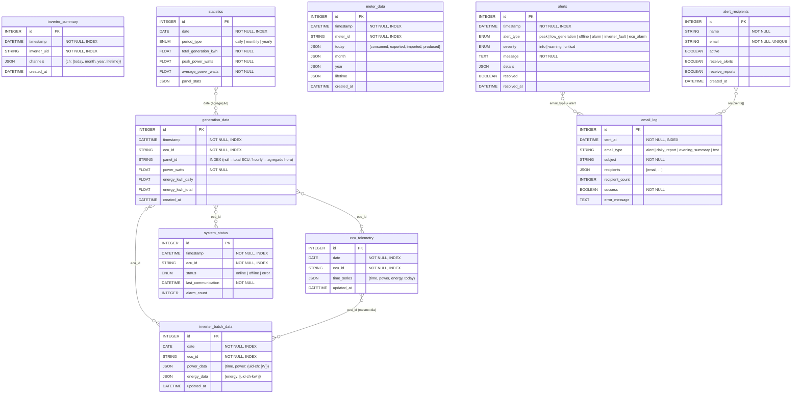

# Modelo de Dados — Sistema de Monitoramento Solar

Banco: `data/solar_monitoring.db` (SQLite)

---

## Diagrama ER

---

## Descrição das Tabelas

### Grupo: Geração

#### `generation_data`
Série temporal bruta coletada a cada ciclo do scheduler.

| Campo | Tipo | Descrição |
|---|---|---|
| `timestamp` | DateTime | Momento da leitura |
| `ecu_id` | String | ID da ECU (ex: `E19H368434753865`) |
| `panel_id` | String | `null` = leitura total da ECU; `'hourly'` = registro horário agregado; UID do painel = leitura individual |
| `power_watts` | Float | Potência instantânea em Watts |
| `energy_kwh_daily` | Float | Energia acumulada no dia (kWh) |
| `energy_kwh_total` | Float | Energia total lifetime (kWh) |

#### `ecu_telemetry`
Série minutely da ECU — uma linha por ECU por dia, atualizada a cada coleta.

| Campo | Tipo | Descrição |
|---|---|---|
| `date` | Date | Data da série |
| `ecu_id` | String | ID da ECU |
| `time_series` | JSON | `{time: ["HH:mm",...], power: [W,...], energy: [kWh,...], today: kWh}` |

**Chave lógica única:** `(date, ecu_id)` — upsert a cada coleta.

#### `inverter_batch_data`
Power telemetry e energia diária de todos os inversores de uma ECU — uma linha por ECU por dia.

| Campo | Tipo | Descrição |
|---|---|---|
| `date` | Date | Data |
| `ecu_id` | String | ID da ECU |
| `power_data` | JSON | `{time: ["HH:mm",...], power: {"uid-ch": [W,...]}}` |
| `energy_data` | JSON | `{energy: ["uid-ch-kwh",...]}` — energia do dia por canal |

**Chave lógica única:** `(date, ecu_id)` — upsert a cada coleta.

#### `inverter_summary`
Snapshot de energia acumulada por inversor e canal (hoje/mês/ano/lifetime).

| Campo | Tipo | Descrição |
|---|---|---|
| `inverter_uid` | String | UID do inversor |
| `channels` | JSON | `{1: {today, month, year, lifetime}, 2: {...}}` — energia em kWh |

#### `statistics`
Estatísticas agregadas calculadas pelo sistema.

| Campo | Tipo | Descrição |
|---|---|---|
| `date` | Date | Data de referência |
| `period_type` | Enum | `daily` / `monthly` / `yearly` |
| `total_generation_kwh` | Float | Total gerado no período |
| `peak_power_watts` | Float | Pico de potência |
| `average_power_watts` | Float | Média de potência |
| `panel_stats` | JSON | Detalhamento por painel/inversor |

---

### Grupo: Medidor

#### `meter_data`
Dados do medidor de energia — balanço consumo vs geração vs rede.

| Campo | Tipo | Descrição |
|---|---|---|
| `meter_id` | String | ID do medidor |
| `today` | JSON | `{consumed, exported, imported, produced}` em kWh |
| `month` | JSON | Mesma estrutura, acumulado no mês |
| `year` | JSON | Acumulado no ano |
| `lifetime` | JSON | Acumulado total |

---

### Grupo: Sistema

#### `system_status`
Histórico de status de comunicação da ECU.

| Campo | Tipo | Descrição |
|---|---|---|
| `ecu_id` | String | ID da ECU |
| `status` | Enum | `online` / `offline` / `error` |
| `last_communication` | DateTime | Último contato bem-sucedido |
| `alarm_count` | Integer | Quantidade de alarmes ativos |

#### `alerts`
Alertas gerados pelo sistema de monitoramento.

| Campo | Tipo | Descrição |
|---|---|---|
| `alert_type` | Enum | `peak` / `low_generation` / `offline` / `alarm` / `inverter_fault` / `ecu_alarm` |
| `severity` | Enum | `info` / `warning` / `critical` |
| `message` | Text | Descrição legível do alerta |
| `details` | JSON | Dados adicionais do contexto |
| `resolved` | Boolean | Se foi marcado como resolvido |
| `resolved_at` | DateTime | Momento da resolução |

---

### Grupo: Email

#### `alert_recipients`
Cadastro de destinatários de alertas e relatórios.

| Campo | Tipo | Descrição |
|---|---|---|
| `email` | String | Endereço único |
| `active` | Boolean | Se recebe emails |
| `receive_alerts` | Boolean | Recebe alertas |
| `receive_reports` | Boolean | Recebe relatórios diários |

#### `email_log`
Histórico completo de todos os emails enviados.

| Campo | Tipo | Descrição |
|---|---|---|
| `email_type` | String | `alert` / `daily_report` / `evening_summary` / `test` |
| `subject` | String | Assunto do email |
| `recipients` | JSON | Lista de endereços destinatários |
| `success` | Boolean | Se o envio foi bem-sucedido |
| `error_message` | Text | Mensagem de erro (se houver) |

---

## Enums

| Enum | Valores |
|---|---|
| `PeriodType` | `daily`, `monthly`, `yearly` |
| `AlertType` | `peak`, `low_generation`, `offline`, `alarm`, `inverter_fault`, `ecu_alarm` |
| `Severity` | `info`, `warning`, `critical` |
| `SystemStatus` | `online`, `offline`, `error` |

---

## Observações de Design

- **Sem foreign keys explícitas** — SQLite permite isso; os vínculos são mantidos por convenção de código (ex: `ecu_id` presente em múltiplas tabelas).
- **Campos JSON** — usados para séries temporais e estruturas variáveis; evitam tabelas filhas para dados de alta frequência.
- **Upsert por chave lógica** — `ecu_telemetry` e `inverter_batch_data` usam `(date, ecu_id)` como chave lógica única, atualizando o registro existente a cada coleta do dia.
- **`generation_data`** — tabela mais volumosa; cresce a cada ciclo de coleta (~a cada 5 minutos durante o dia).
